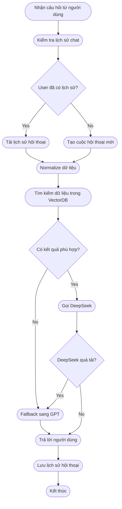

# 🏦 Quy trình xây dựng Chatbot cho Ngân hàng Lào Việt (LVBank)

---

## 1. Khảo sát & Thu thập dữ liệu

- Tiến hành khảo sát nhu cầu thực tế từ:
  - Bộ phận nghiệp vụ ngân hàng.
- Nguồn dữ liệu:
  - Câu hỏi thường gặp (FAQ).
  - Website chính thức của ngân hàng.
  - Tài liệu nội bộ: quy trình, biểu phí, chính sách.
  - Lịch sử hội thoại từ các kênh CSKH (nếu có).
  - Dữ liệu nên được tổng hợp dưới dạng `.csv` hoặc `.xlsx`.

## 2. Làm sạch & Chuẩn hóa dữ liệu

- Loại bỏ từ thừa, cảm thán, thông tin lan man.
- Gom nhóm các câu hỏi tương đương vào cùng topic.
- Tối ưu nội dung để AI dễ hiểu, ít gây nhầm lẫn.
- Viết lại câu trả lời theo phong cách: **ngắn gọn – đúng trọng tâm – dễ hiểu**.
- Chuẩn hóa về định dạng: topic | intent | question | answer | lang
## 📦 Định dạng chuẩn đầu vào dữ liệu chatbot (LVBank)

Mỗi dòng dữ liệu chatbot cần được lưu theo cấu trúc bảng gồm **5 trường chính**:

---

### 🧱 Mô tả từng trường

| Trường   | Bắt buộc | Mô tả chi tiết |
|----------|----------|----------------|
| `topic`  | ✅ | Chủ đề chính của câu hỏi. Dùng để nhóm các câu hỏi liên quan lại với nhau. Viết ngắn gọn và bao quát được chủ đề |
| `intent` | ✅ | Ý định hỏi của người dùng, dùng để định hướng cho NLP truy vết, có kết nối chặt chẽ với question |
| `question` | ✅ | Câu hỏi mẫu mà người dùng thường đặt ra. Có thể viết bằng ngôn ngữ tự nhiên sát nhất với những câu hỏi của khách hàng |
| `answer` | ✅ | Câu trả lời chính xác, đúng nghiệp vụ ngân hàng. Nên ngắn gọn, súc tích, không lan man. |
| `lang` | ✅ | Ngôn ngữ sử dụng cho question và answer, dùng cho tác vụ đa ngôn ngữ khi có từ 2 ngôn ngữ trở lên |
---

### 📌 Ví dụ minh họa

| topic             | intent |  question                                             | answer |
|-------|---------|--------------------------------------------|--------|
| faq   | mo_tai_khoan  | Làm sao để mở tài khoản ngân hàng?          | Quý khách có thể mở tài khoản trực tiếp tại quầy giao dịch hoặc qua ứng dụng LVBank Mobile. |
| faq   | chuyen_tien |         Chuyển tiền liên ngân hàng mất bao lâu?    | Thời gian xử lý thường từ 5 đến 30 phút tùy vào hệ thống ngân hàng nhận. |
| faq   | rut_tien |          Rút tiền ATM khác ngân hàng có mất phí không?  | Có. Mỗi giao dịch rút tiền tại ATM ngân hàng khác sẽ bị tính phí 3.300 VND/giao dịch. |

---

### 🔧 Gợi ý mở rộng (Không bắt buộc)

| Trường mở rộng | Mô tả |
|----------------|------|
| `Prompt`       | Mẫu yêu cầu dành riêng cho mô hình AI nếu muốn tạo phản hồi đặc thù. |
| `Source`       | Ghi chú nguồn dữ liệu: "Website LVBank", "Tài liệu nội bộ",... |

---

### ✅ Ghi chú

- Mỗi dòng đại diện cho **1 mẫu câu hỏi – 1 câu trả lời – 1 chủ đề - 1 ý định - 1 ngôn ngữ**.
- Tránh copy từ Word/PDF để không dính lỗi ký tự ẩn.
- Nội dung càng chuẩn thì AI trả lời càng sát và không bị ảo giác.

---
---

## 3.1. Xây dựng logic xử lý Chatbot

---

## 🧠 Mô tả Workflow Chatbot LVBank

### 🔹 Bước 1: Nhận câu hỏi từ người dùng
- Chatbot tiếp nhận câu hỏi từ Telegram, web hoặc app.

### 🔹 Bước 2: Kiểm tra lịch sử chat
- Xác định xem người dùng này đã có phiên trò chuyện trước đó hay chưa.

### 🔹 Bước 3: Rẽ nhánh xử lý
- **Nếu đã có lịch sử:** tải đoạn hội thoại gần nhất.
- **Nếu chưa có:** tạo mới một phiên hội thoại trống.

### 🔹 Bước 4: Normalize dữ liệu
- Làm sạch câu hỏi đầu vào (xử lý chính tả, loại bỏ từ thừa, viết lại ngắn gọn...).

### 🔹 Bước 5: Tìm kiếm dữ liệu
- Dùng Vector Search (ChromaDB) để tìm nội dung liên quan đến câu hỏi.

### 🔹 Bước 6: Kiểm tra kết quả tìm kiếm
- Nếu **không tìm thấy kết quả phù hợp** → chuyển sang Fallback GPT.
- Nếu **có kết quả** → tiếp tục gọi model chính (DeepSeek hoặc tương đương).

### 🔹 Bước 7: Gọi mô hình AI
- Gọi DeepSeek để tạo câu trả lời từ dữ liệu tìm được.

### 🔹 Bước 8: Kiểm tra trạng thái DeepSeek
- Nếu DeepSeek **quá tải / lỗi** → chuyển sang GPT để trả lời.
- Nếu hoạt động tốt → lấy câu trả lời từ DeepSeek.

### 🔹 Bước 9: Trả lời người dùng
- Gửi lại nội dung trả lời đã được xử lý từ AI.

### 🔹 Bước 10: Lưu lịch sử
- Ghi lại đoạn hội thoại hiện tại để dùng cho lần hỏi tiếp theo.

### 🔹 Bước 11: Kết thúc phiên xử lý

---

📝 **Ghi chú:**
- Mọi nhánh đều được xử lý qua Normalize để đảm bảo dữ liệu đầu vào chuẩn.
- Fallback GPT đóng vai trò dự phòng khi không có dữ liệu hoặc model chính lỗi.
- Cấu trúc này phù hợp để mở rộng sang đa ngôn ngữ, đa nền tảng.

### 3.2 ⚙️ Backend – Thiết lập API để kết nối logic Chatbot

#### 🎯 Mục tiêu

Backend có vai trò thiết lập môi trường để kết nối với các chức năng xử lý logic chatbot. Toàn bộ phần “xử lý thông minh” nằm ở phần logic, backend chỉ làm nhiệm vụ **tạo đường dẫn URL và kết nối**.

#### ✅ Các bước triển khai backend:

##### 🔹 Bước 1: Tạo môi trường và định tuyến (routing)

- Khởi tạo môi trường backend bằng một framework.
- Thiết lập cấu trúc thư mục để dễ dàng mở rộng và quản lý logic riêng biệt.

##### 🔹 Bước 2: Tạo đường dẫn (endpoint) cho API

- Định nghĩa các URL endpoint dùng để tiếp nhận và xử lý yêu cầu từ người dùng.
- Các endpoint thường có dạng `/chat`, `/reset`,...

##### 🔹 Bước 3: Gắn endpoint với logic xử lý

- Gắn các hàm xử lý từ phần "logic chatbot" vào các endpoint tương ứng.
- Backend không xử lý nội dung câu hỏi mà chỉ **chuyển dữ liệu đến nơi xử lý và nhận kết quả trả về**.

##### 🔹 Bước 4: Đăng ký các router chức năng

- Gom các endpoint theo nhóm chức năng để dễ bảo trì (ví dụ: nhóm chat, nhóm admin).
- Đảm bảo backend gọi đúng logic xử lý tương ứng với từng loại yêu cầu.

#### 🛡️ Lưu ý khi triển khai:

- Backend không nên chứa logic xử lý AI mà chỉ đóng vai trò trung gian kết nối.
- Cần xử lý các trường hợp lỗi khi gọi logic (timeout, lỗi kết nối, lỗi model...).
- Đảm bảo bảo mật endpoint (rate limit, kiểm tra token nếu cần).

---

### 3.3 💬 Triển khai Frontend – Kết nối giao diện người dùng

#### 🎯 Mục tiêu

Triển khai giao diện cho người dùng tương tác với chatbot. Frontend có thể là Telegram bot, website tích hợp hoặc ứng dụng mobile. Tùy theo kênh sử dụng, cấu hình và triển khai giao diện phù hợp để truyền câu hỏi tới backend và hiển thị phản hồi từ chatbot.

#### ✅ Các kênh frontend phổ biến

##### 🔹 Telegram Bot

- Dễ triển khai, không cần tạo giao diện UI.
- Người dùng chat trực tiếp trên Telegram.
- Cần cấu hình webhook từ Telegram về backend chatbot.

##### 🔹 Website (Chat widget)

- Tích hợp khung chat vào website chính thức của ngân hàng.
- Gửi/nhận tin nhắn qua API (REST hoặc WebSocket).
- Có thể dùng thư viện như `BotUI`, `React Chatbot`, `Chatwoot`,...

##### 🔹 Ứng dụng Mobile

- Tích hợp trực tiếp vào app ngân hàng.
- Giao tiếp với backend qua HTTP hoặc gRPC.
- Cần hỗ trợ đa ngôn ngữ và UX thân thiện.

#### ✅ Các bước triển khai frontend

##### 🔹 Bước 1: Thiết lập giao diện người dùng

- Tùy chọn đa nền tảng (Fb, Whatsapp, web...).
- Tạo giao diện nhập câu hỏi và hiển thị câu trả lời.

##### 🔹 Bước 2: Kết nối với backend API

- Gửi câu hỏi đến endpoint backend (`/chat`).
- Nhận và hiển thị câu trả lời trả về từ chatbot.

##### 🔹 Bước 3: Quản lý phiên hội thoại (nếu cần)

- Lưu thông tin người dùng (user ID) để gửi kèm theo câu hỏi.
- Hiển thị lịch sử hội thoại trong giao diện.

##### 🔹 Bước 4: Giao tiếp thời gian thực (nâng cao)

- Có thể dùng WebSocket để nhận phản hồi dạng stream (từng dòng).
- Tăng tính tự nhiên như đang chat với người thật.

#### 🛡️ Lưu ý khi triển khai frontend

- Phản hồi từ chatbot cần hiển thị đúng nội dung, rõ ràng, dễ đọc.
- Cần hiển thị thông báo lỗi khi backend không phản hồi.
- Đảm bảo trải nghiệm đa thiết bị, đa ngôn ngữ.

---

